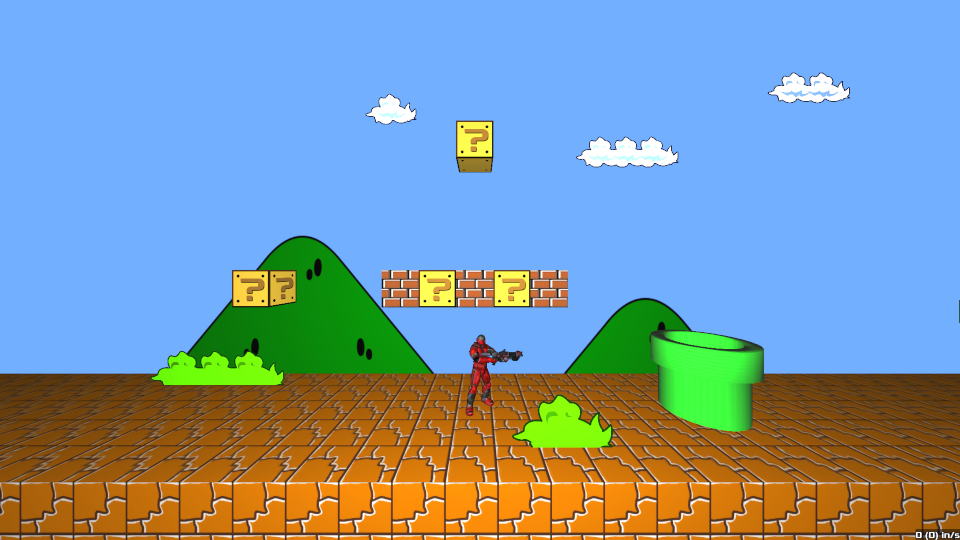

# xonotic-sxb
Super Xonotic Brothers

A Super Mario themed collection of assets and maps for Xonotic!



[source](https://github.com/z/xonotic-sxb.pk3dir)


#### Building

Requirements to build: Netradiant (for q3map2)

Create a file named `build.conf` in this project's root directory, and set the path variables. You can use the example conf as your base: `cp build.example.conf build.conf`

Example:

```
XONDIR=$HOME/games/xonotic
RADIANTDIR=$XONDIR/netradiant/install
```

Build maps with:

```
./build.sh -a
```

Other options:

```
./build.sh -d      # remove bsps
./build.sh -s 1-3  # compile single map with [world]-[level] 
```


#### Playing

As of Xonotic 0.8.1, the side-scrolling mod is a part of the game, no client modifications required to play these levels!

Play maps by typing `map mapname` e.g. `map sxb1_1-1`


#### Contributing

Pull requests are welcome, but we'd really like to hear from you first, find us in #xonotic on irc.quakenet.org

